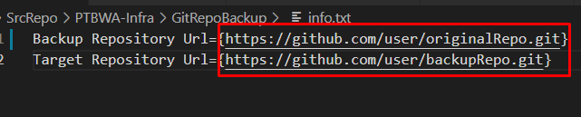

# 아침 점검 
 

## Discription
- 깃의 기존 레포지토리를 클론해 와서 새 브랜치를 만들어 푸쉬하는 스크립트

 

## 실행 방법

### git-backup-Url.bat
 
- 백업할 레포지토리의 주소를 복사합니다.

 
- git-backup-Url.bat 파일을 실행하고 복사한 주소를 입력합니다.
- 백업한 브랜치를 푸쉬할 레포지토리의 주소도 마찬가지로 복사하여 입력합니다.

 
- 디렉토리 및 브랜치 이름은 `backup_날짜시간`입니다.

_______________________________________________

### git-backup-Url.bat
 
- 레포지토리의 주소를 info.txt 파일에 입력해 둡니다.
- `{  }` 안의 내용만 수정해야 하고, 다른 부분을 수정할 경우 작동하지 않을 수 있습니다.
- git-backup-Url.bat 파일을 실행합니다.

 

## Update
- 2022.01.13
    - 최초 버전 업로드

 

