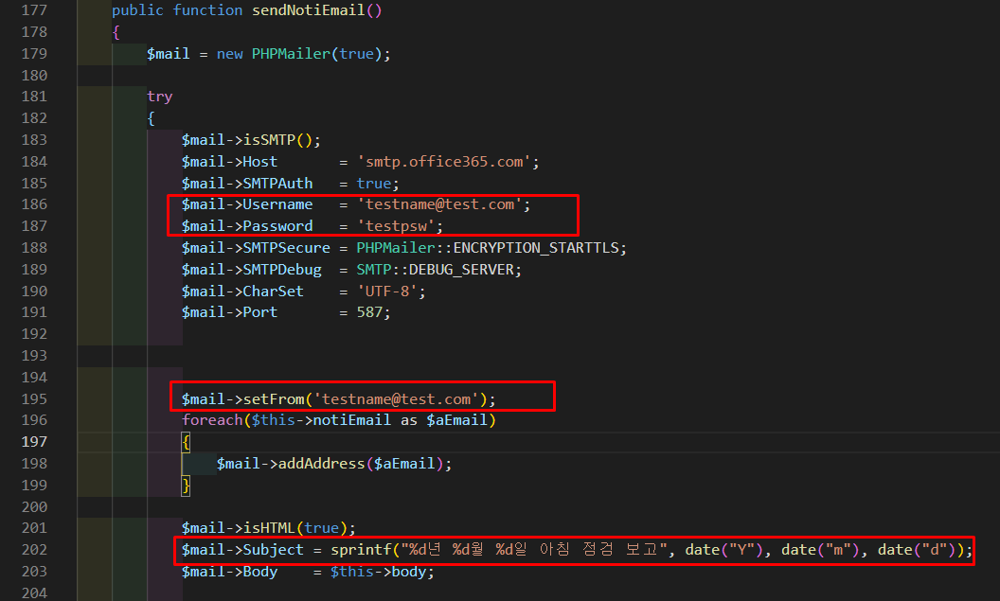
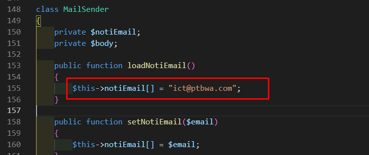
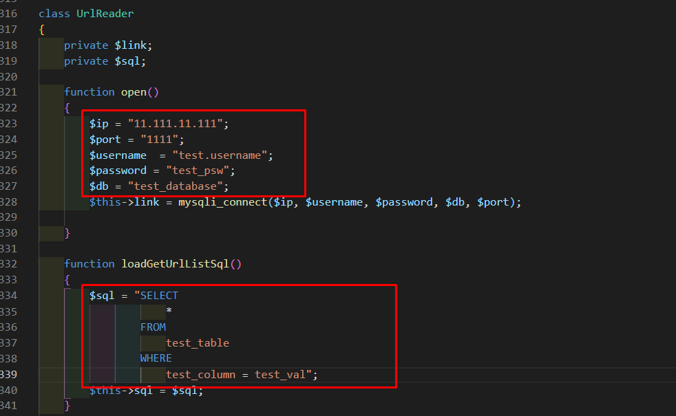
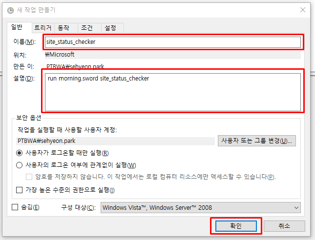
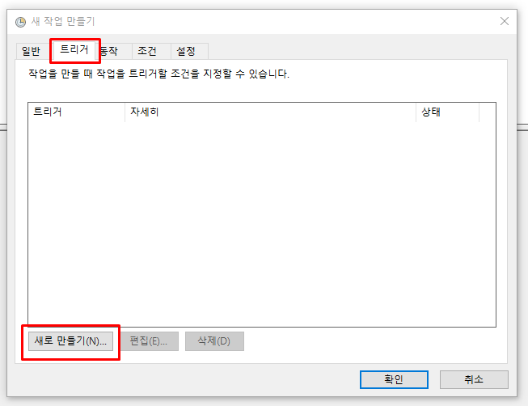
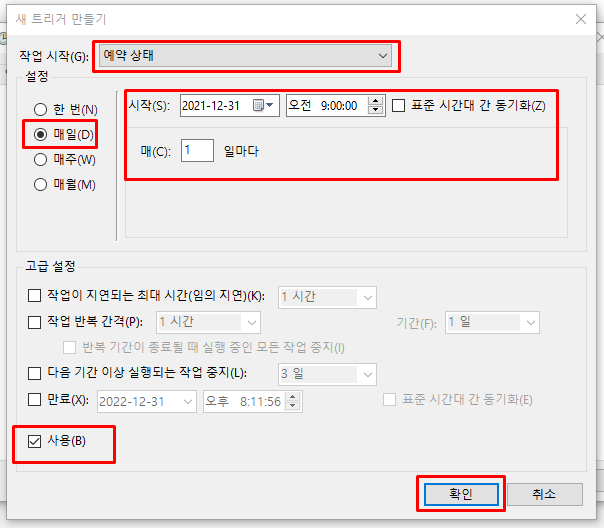
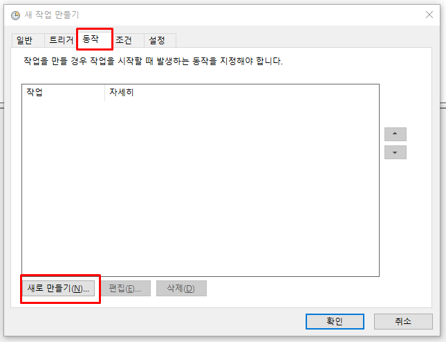
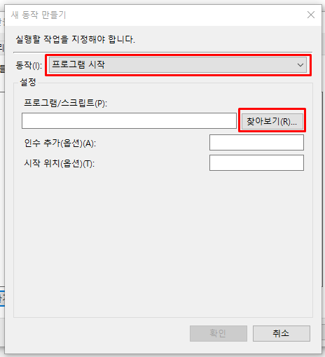
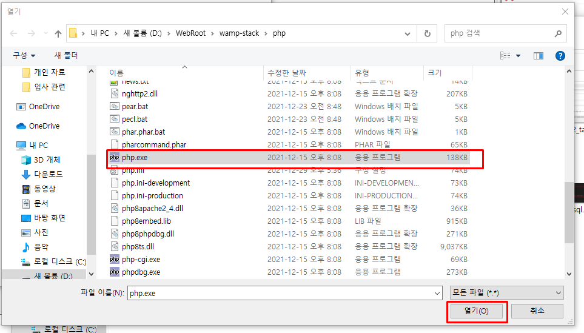
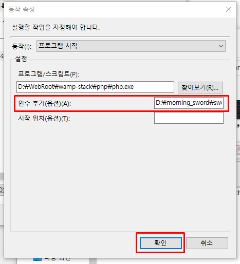

# 아침 점검 
<br/>

## Discription
- 아침 점검 자동화 프로그램
- 데이터베이스로부터 url 정보를 불러들이고 정상 접속 되는지 확인
- url 접속 성공 여부를 기타 채널로 전송


<br/>


## 메일 설정
 
- 발신자 SMTP 옵션 설정
- 발신자 주소 및 제목 입력
_______________________________________________

 
- 수신자 이메일 주소 불러오기 또는 입력
_______________________________________________

<br/>


## 데이터베이스 설정
 
- 접근할 데이터베이스 정보 입력
- 실행할 SQL 입력
_______________________________________________


<br/>


## 실행 방법
 
- `Scheduler`에서 `새 작업 만들기` 생성 후에 스케줄 작업 이름 및 설명 입력
_______________________________________________

 
- `트리거` 탭 선택 후 `새로 만들기` 버튼 클릭
_______________________________________________

 
- 조건에 맞게 작업 및 시간 설정
_______________________________________________

 
- `동작` 탭 선택 후 `새로 만들기` 버튼 클릭
_______________________________________________

 
- `동작` 을 프로그램 시작으로 설정한 뒤에 `찾아보기` 버튼 클릭
_______________________________________________


 
- `php` 가 설치된 디렉토리를 찾아서 실행 파일 선택 후 `열기` 클릭
_______________________________________________

 
- `인수 추가` 에 실행하고자 하는 파일 (`sword_main.php`) 의 경로를 입력
```
ex) `D:\morning_sword\sword_main.php`
```
_______________________________________________


<br/>


## Update
- 2021.12.31 
    - 테스트 버전 업로드


<br/>


