## 컴포저란? 
- 컴포저(Composer)는 의존성 관리 도구입니다. 
- 컴포저는 php 프로젝트에서 사용하는 외부 라이브러리들을 쉽게 설치하고 업데이트해 줍니다. 
- 컴포저는 필요한 라이브러리를 설치해주는 기능도 있지만, 라이브러리를 통합해서 관리해주는 관리자입니다.
- 다른 언어에서 사용하는 의존성 관리 도구와 비슷한 기능을 제공합니다. 
- 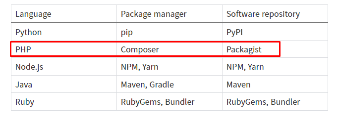 
<!--사진 출처 - https://aahc.tistory.com/14 -->

<br/>

## 컴포저를 쓰는 이유
- 한 패키지가 제대로 작동하려면 다른 패키지가 필요하기도 합니다. 이런 패키지를 'dependency'라고 합니다.
- dependency가 되는 패키지는 또 다른 패키지를 dependency로 가지면서 서로 겹치기도 하고 충돌하기도 합니다.
- 이런 계층이 깊게 이어질수록 수동으로 패키지를 관리하기가 불가능에 가까워집니다.
- 컴포저는 각각의 패키지가 갖는 dependency 정보를 통합하여 쉽게 설치하거나 관리할 수 있도록 도와줍니다.
- 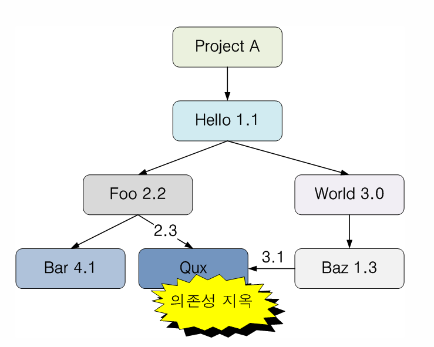 
<!-- 사진 출처 - https://www.lesstif.com/laravelprog/dependency-hell-26083775.html -->

<br/>

## 컴포저 사용 방법

### 컴포저 설치하기 
```
https://getcomposer.org/download/
```
- 위 사이트에 접속하여 인스톨 파일을 다운받습니다.
- 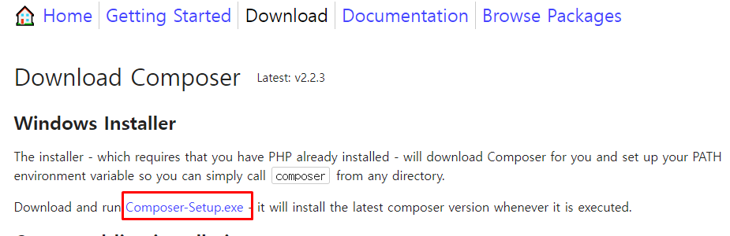 
- 다운로드 받은 인스톨 파일을 실행하여 설치를 진행합니다.

_____________________________________________
<br/>


### composer.json 파일 작성하기 
```
{
    "require": {
        "monolog/monolog": "1.0.*@beta",
        "acme/foo": "@dev"
    }
}
```
- dependency 정보를 "require" 속성에 선언합니다.
- 선언 방식은 다음과 같습니다.
- `"vendor-name/package-name": "version info"`
- 버전 정보를 입력하는 방법은 다음과 같습니다.
-  

_____________________________________________
<br/>


### 컴포저를 사용해 라이브러리 설치하기 
- 컴포저 명령어를 사용하면 `composer.json` 파일에 선언해 놓았던 dependency들을 자동으로 읽어 와서 설치합니다.
- 프로젝트 루트 디렉토리에 `composer.json` 파일을 두고 커맨드 창을 열어 해당 디렉토리로 이동합니다.
- 아래 명령어를 실행합니다.
```
composer install
```

- 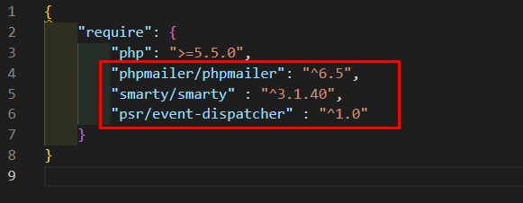 
- `composer.json` 파일에서 위와 같이 dependency를 선언한 경우, 아래와 같이 실행됩니다.

- 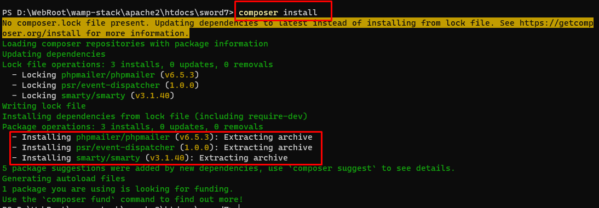 
- 선언했던 dependency들이 아래와 같이 `vendor` 폴더 안에 설치된 것을 확인할 수 있습니다.

- 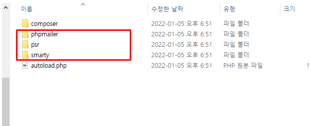 

_____________________________________________
<br/>

### composer.lock 파일과 기능 
- `composer install` 명령어를 수행하고 나면 `composer.lock` 파일이 생성됩니다.
- `composer.lock`는 프로젝트가 사용한 dependency 정보들을 사진처럼 찍어서 저장해 둔 자료입니다.
- `composer.lock` 파일을 참고하면 개발 환경이 달라지거나 시간이 지나더라도 똑같은 dependency 조건을 확보할 수 있습니다.
- `composer install` 명령어를 실행할 때 `composer.lock` 파일이 이미 존재한다면 `composer.json` 파일에 선언해 둔 정보를 무시한 채 `composer.lock`에 담겨 있는 정보에 따라 dependency를 설치합니다.

_____________________________________________
<br/>

### packagist 
- packagist는 컴포저가 사용하는 저장소입니다. 
- packagist에 게시된 모든 패키지는 `require` 속성에 선언함으로써 설치할 수 있습니다.
- 아래 사이트에서 packagist에 게시된 패키지 정보를 검색할 수 있습니다.
```
https://packagist.org/
```
- 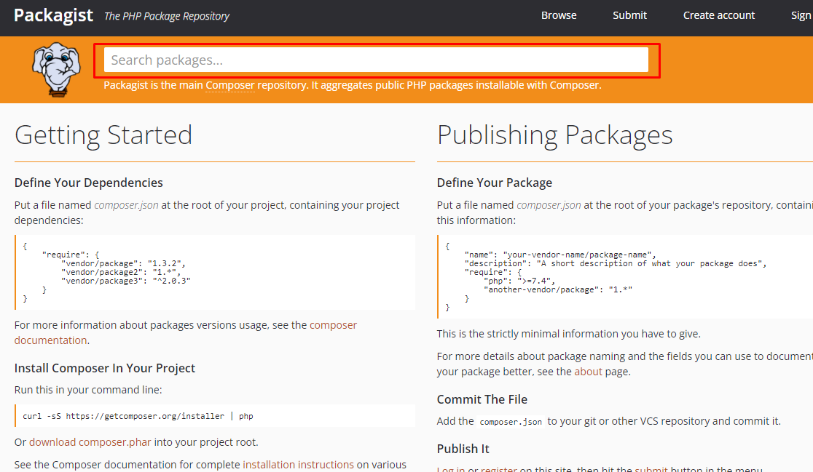 

_____________________________________________
<br/>

### 컴포저 커맨드라인 명령어 가이드
- 아래 사이트에서 컴포저 명령어를 살펴볼 수 있습니다.
```
https://xpressengine.github.io/Composer-korean-docs/doc/03-cli.md/
```

<br/>

## 에디터에 컴포저 플러그인을 설치하여 사용하기 
- 먼저 컴포저를 인스톨한 상태여야 합니다. 

_____________________________________________
<br/>

### 플러그인 설치하기 
- 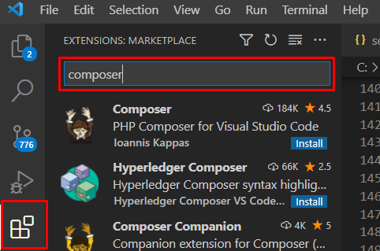 
- Extensions Marketplace 에 (단축키 `Ctrl` + `Shift` + `X`) `composer`를 검색합니다.

- 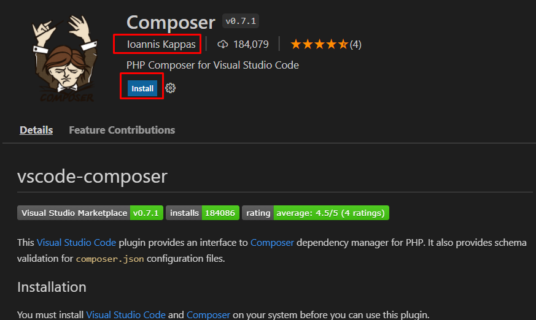 
- 제공자 정보를 확인하고 `install` 버튼을 클릭합니다.

_____________________________________________
<br/>

### 플러그인 설정하기 
- 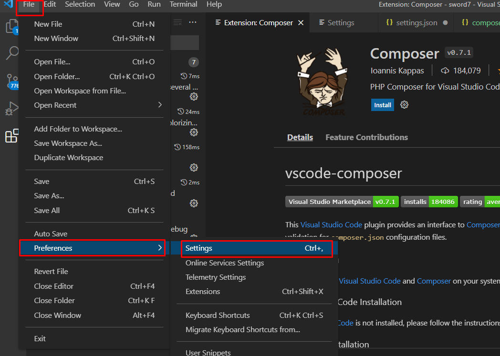 
- 상단 메뉴에서 `File - Preferences - Settings` 순으로 클릭합니다. (단축키 Ctrl + ,)

- 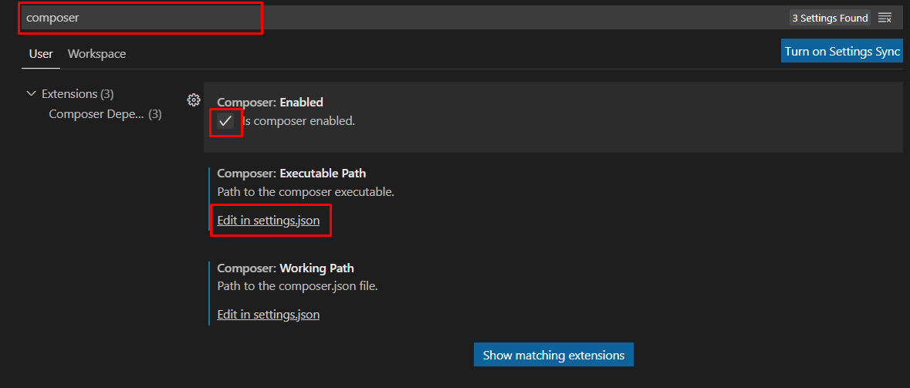 
- 검색창에 `composer`를 입력합니다
- `Composer : Enabled` 속성을 활성화합니다.
- `Edit in settings.json`을 클릭합니다.
- 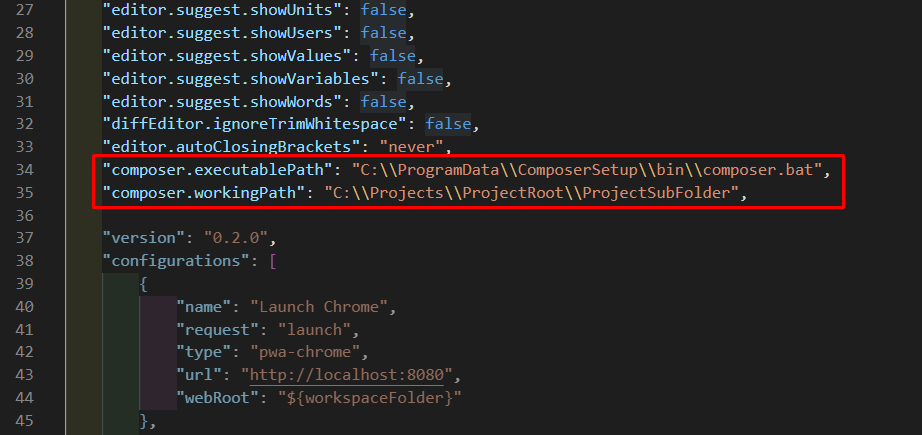 
- composer.bat 파일의 경로를 `"composer.executablePath"` 속성에 입력합니다. <span style="color: red;">(필수)</span>
```
{
    "composer.executablePath": "C:\\ProgramData\\ComposerSetup\\bin\\composer.bat"
}
```
- 불러올 composer.json이 존재하는 경로를 `"composer.workingPath"` 속성에 입력합니다. (생략할 경우 프로젝트의 루트 폴더가 기본값으로 설정됨)
```
{
    "composer.workingPath": "C:\\Projects\\ProjectRoot\\ProjectSubFolder"
}
```

<br/>

### 플러그인 사용하기 
- 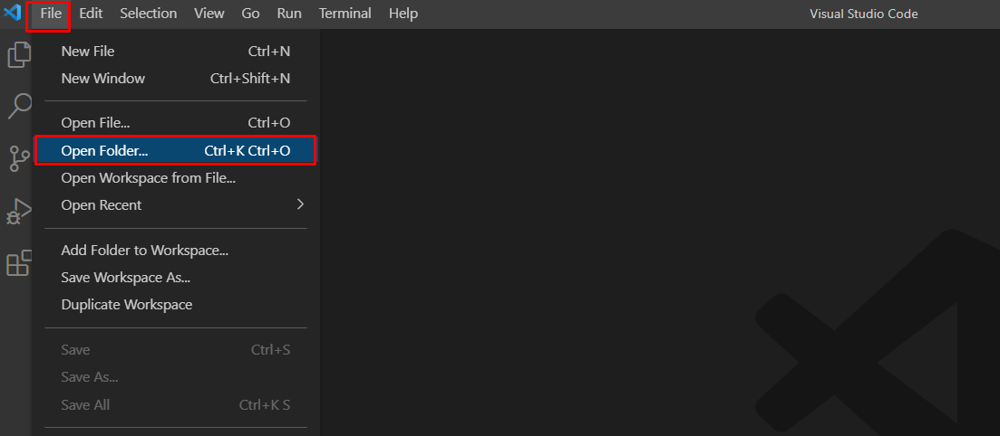 
- 상단 메뉴에서 `File - Open Folder` (단축키 `Ctrl` + `K, O`) 를 클릭해 프로젝트 폴더를 엽니다.

-  
- VSCode의 명령창을 열어서 (단축키 `F1` 또는 `Ctrl` + `Shift` + `P`) composer 명령문을 실행합니다.

<br/>

## Shell 커맨드로 컴포저 설치 및 실행하기 
### 직접 실행 
- 커맨드 창을 열고 해당 디렉토리로 이동 후에 다음 코드를 입력합니다.
- 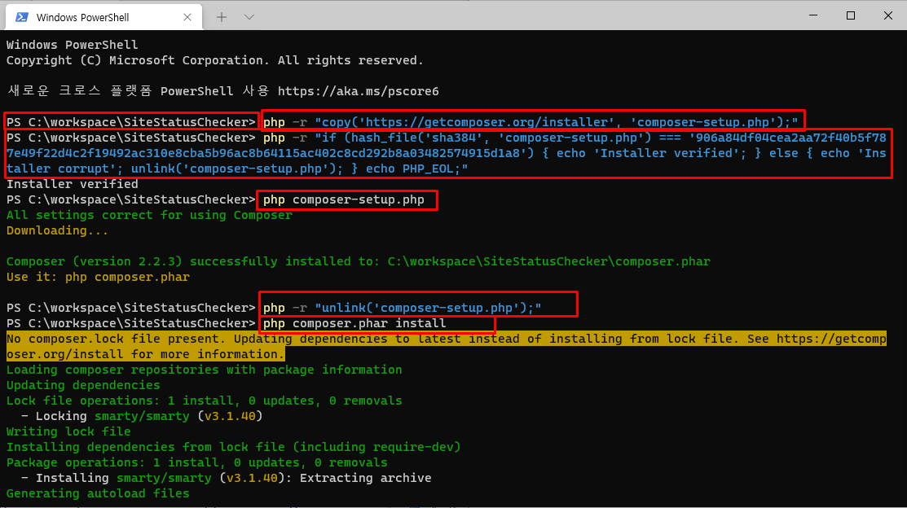 
```
php -r "copy('https://getcomposer.org/installer', 'composer-setup.php');"
php -r "if (hash_file('sha384', 'composer-setup.php') === '906a84df04cea2aa72f40b5f787e49f22d4c2f19492ac310e8cba5b96ac8b64115ac402c8cd292b8a03482574915d1a8') { echo 'Installer verified'; } else { echo 'Installer corrupt'; unlink('composer-setup.php'); } echo PHP_EOL;"
php composer-setup.php
php -r "unlink('composer-setup.php');"
php composer.phar install
```

_____________________________________________
<br/>

### 배치 파일로 실행 

- 위의 커맨드를 자동으로 실행하도록 배치 파일을 만들어 실행

_____________________________________________
<br/>

## 컴포저 GUI composercat 사용하기
- 먼저 컴포저가 설치되어 있어야 합니다.

### 장점
- 라이브러리 정보를 일일이 packagist에 접속하여 확인할 필요 없이 검색 기능을 제공합니다.
- 클릭만으로 라이브러리 정보와 버전을 composer.json 파일에 추가해 줍니다.
- 클릭만으로 composer 명령어들을 수행해 줍니다.

_____________________________________________
<br/>


### 설치하기 
- 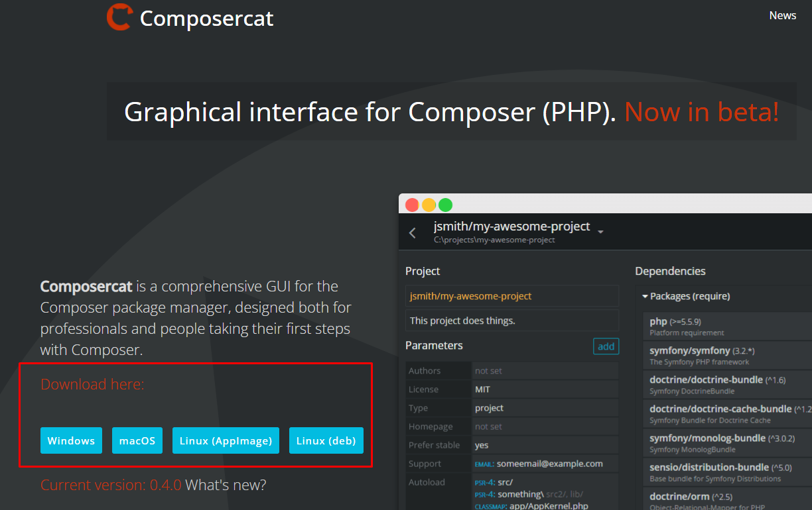 
- 아래 사이트에서 인스톨 파일을 다운받아 설치를 진행합니다.
```
https://getcomposercat.com/

```
_____________________________________________
<br/>


### 사용하기  
- 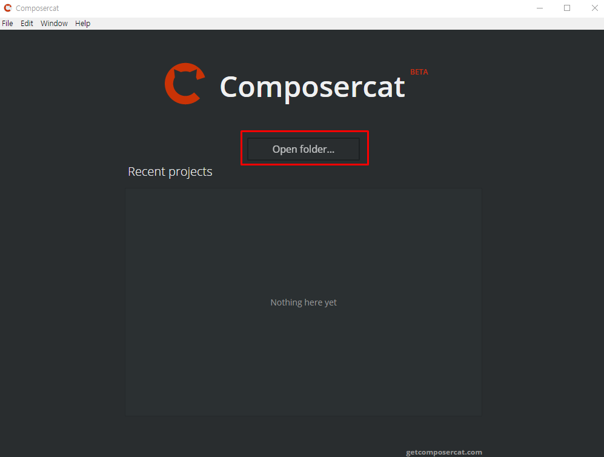 
- `Open folder...` 버튼을 클릭하여 프로젝트 루트 폴더를 엽니다.
- 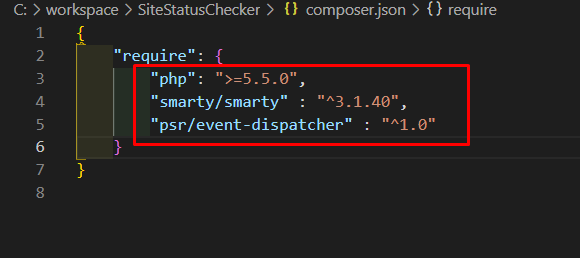 
- 프로젝트 루트 폴더에 존재하는 composer.json 파일에 위와 같이 선언해 놓은 require 속성이 아래와 같이 표시됩니다.
- 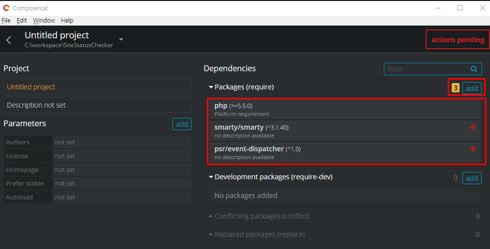 
- `add` 버튼을 눌러 라이브러리를 추가합니다.
- 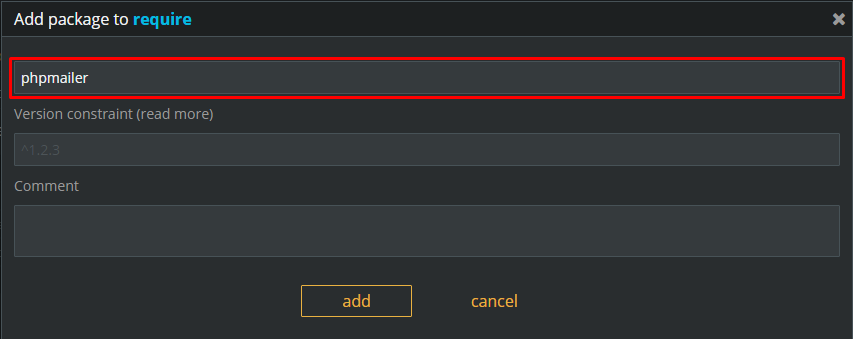 
- 검색어를 입력합니다.
- 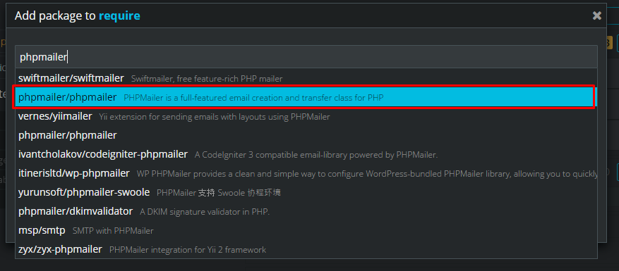 
- 원하는 라이브러리를 선택합니다.
- 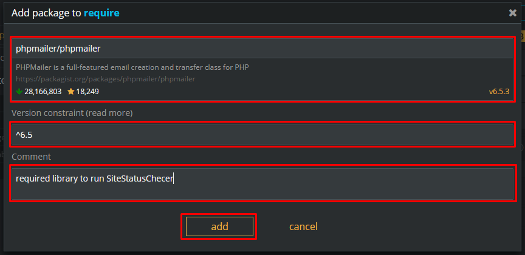 
- 라이브러리 정보를 확인하고 버전과 코멘트(선택 사항)를 입력한 뒤 `add` 버튼을 클릭합니다.
- 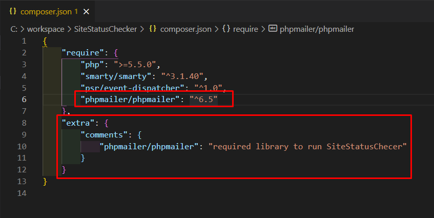 
- 선택한 라이브러리 정보가 `composer.json` 파일에 반영됩니다.
- 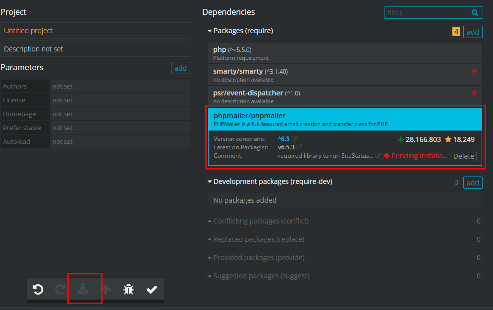 
- 좌측 하단 인스톨 버튼을 클립합니다.
- 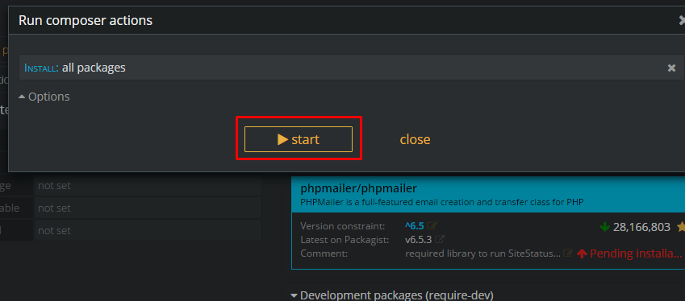 
- `start` 버튼을 클릭합니다.\
- 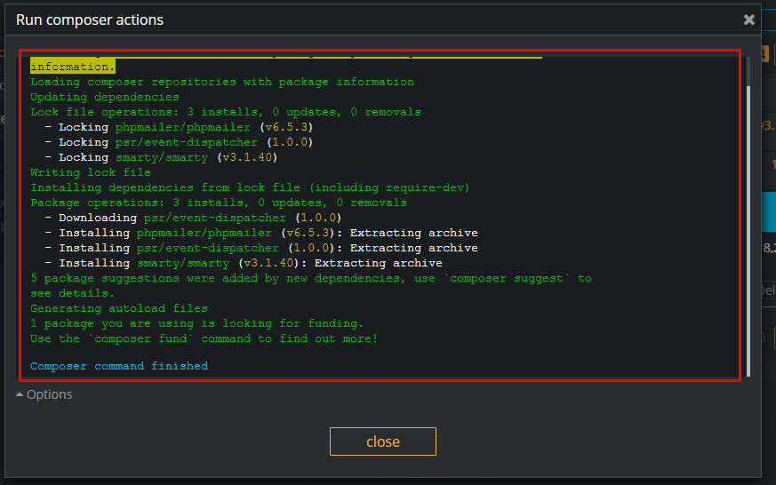 
- 실행 로그와 함께 라이브러리가 설치된 것을 확인할 수 있습니다.
- 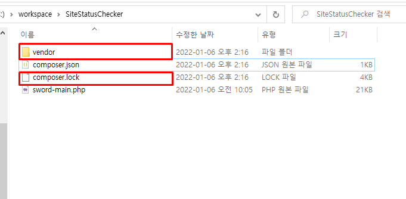 
_____________________________________________
<br/>
